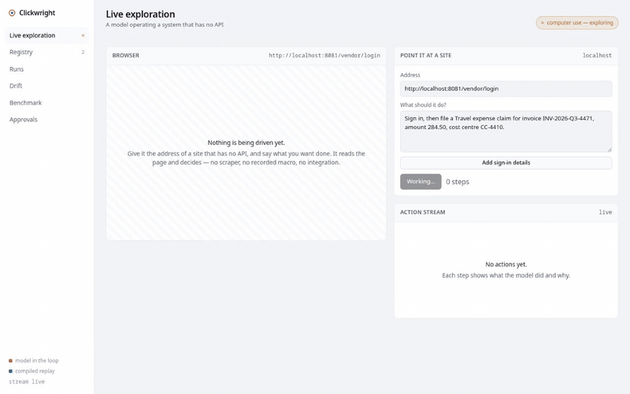
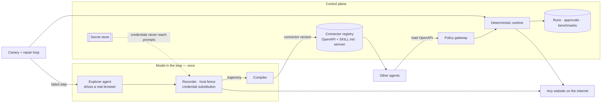

# Clickwright

**Your agent looks at the screen once. Then it never has to again.**

Every computer-use agent — Gemini, Claude, OpenAI — burns thousands of tokens per task
just watching the screen: screenshot, interpret, decide, click, repeat. Do it 1,000
times and you've spent the price of a dinner out on pixels of a login form.

Clickwright watches an AI agent complete a task in a real browser *once*, compiles the
recording into a connector, and from then on replays it in ~1 second with no model in
the loop. **$0 per call.** Any agent in your fleet can call it through a standard
OpenAPI endpoint — no screen, no tokens, no interpretation.

```
agent burns 12,000 tokens watching a screen → task complete

            ↓

Clickwright: compile that recording into a connector

            ↓

any agent calls it → 1 second, $0, no model, no screen
```

<p align="center">
  
</p>
<p align="center"><sub>Real run, unedited: an agent books an appointment on a healthcare portal.
When it reaches the irreversible submit, the policy gateway holds it — and a human approves it from the console.</sub></p>

---

## The problem with computer-use

Every major AI company is shipping computer-use agents: give the model a browser, let
it look at screenshots, let it click. It works. It's also expensive and slow — because
**every single task** means:

1. Render the screen → 1 screenshot ≈ 1,000–3,000 tokens
2. The model reads the screen, decides what to do → 1 inference call
3. Click/type → go back to step 1
4. Repeat 8–15 times per task

A 10-step task on Gemini Pro costs roughly **$0.03–0.06** and takes **30–60 seconds**
(measured across CURA Healthcare and the bundled target). Do it 1,000 times a month on
the same task — expense filings, appointment bookings, status checks — and you've spent
**$30–60** and waited **8–10 hours** on something a script could do in seconds.

Even if the system has an API, the agent still burns tokens figuring out how to call it:
reading docs, handling auth, interpreting responses. The overhead is real.

**Clickwright cuts it out.** One recording. One compilation. Every future call is a
deterministic replay: no screenshots, no model, no tokens. Just `POST` → done.

---

## Why it's different

| | Clickwright | Screen scrapers | Agent every time |
| --- | --- | --- | --- |
| How it drives the site | Real steps recorded from a real session | Fragile HTML parsing | AI looks and clicks, every run |
| Cost per call | **$0** — no model | $0 | $0.03–0.06 per task (measured) |
| Speed per call | **~1–2 s** | fast | 30–60 s |
| Token consumption | **Zero after compilation** | Zero | 8,000–30,000 per task (measured) |
| Survives redesigns | **Yes — detects, repairs, republishes** (costs one model run) | No | Yes, at full token cost |
| Callable by other agents | **Yes — OpenAPI + SKILL.md generated on demand** | No | With glue code |

Computer-use agents burn tokens on every screen they see. Clickwright makes that a
one-time cost.

---

## Quick start

Prerequisites: Python 3.11+, Node 20+, `pnpm`, and an API key from
[OpenRouter](https://openrouter.ai) or any OpenAI-compatible endpoint.
See *Configuration* for alternatives.

```bash
cp .env.example .env      # add your OPENROUTER_API_KEY
make install              # venv + Chromium + frontend deps
```

Three terminals:

```bash
make portal     # :8081   a bundled target system
make api        # :8080   control plane + connector gateway
make console    # :5173   web console
```

Open [http://localhost:5173](http://localhost:5173):

1. **Live** view is pre-filled with a sample target — press **Start** and watch the
   agent work: every step shows what it did and why, with screenshots.
2. When it finishes, the connector appears under **Registry**. Call it the way another
   agent would (this is just the bundled sample — your connectors will match whatever
   site you pointed it at):

   ```bash
   # sample call against the bundled target
   curl -X POST http://localhost:8080/connectors/vendor-portal/expense-claim \
     -H 'content-type: application/json' \
     -d '{"claim_type":"Travel","invoice_reference":"INV-2","amount_usd":"120.00","cost_centre":"CC-4410"}'
   ```

   Seconds later you get the confirmation reference. No model was involved.
3. Point **Live** at any real site you have access to — replace the URL and describe the
   task in plain English. It works on any website: supplier portals, healthcare booking,
   news sites, e-commerce, internal admin consoles. Sign-in details go in **Add sign-in
   details**; they are stored outside the model and substituted into the browser
   automatically.

### Watch it heal itself

Restart the bundled target with a redesigned UI, then hit **Canary** in the Registry:

```bash
make portal-drift     # the submit button becomes a different control; copy changes
```

The health check fails at exactly the broken step, the repair loop re-learns that step,
and a new connector version is published — visible under **Drift** with a diff and who
(or what) fixed it.

---

## Benchmarks

An AI agent clicking through a website is slow and costs money every single time.
Clickwright watches that agent once, writes down the steps as a reusable *connector*,
and from then on does the job instantly, for free, with no AI in the loop. But websites
change their buttons — so the real question isn't "does it work today?" but
"**does it notice when the website breaks it, and does it fix itself?**"

The benchmark (`bench/run_suite.py`) answers with three checks. None of them need an AI
model to run:

| Check | What it asks | Why it matters |
| --- | --- | --- |
| **Does it still work?** | Replay the saved steps against the real website | This is the product: seconds per call, $0 |
| **Does it find the break?** | Secretly break one step's pointer to a button; the health-check must name *that exact step* | A fixer that repairs the wrong step is worse than useless |
| **Does it recover?** | Put the good steps back — the next call must succeed | Proves breakage is temporary, not permanent damage |

Run it yourself against everything in your registry:

```bash
PYTHONPATH=. python -m bench.run_suite
```

It prints a table and saves a full report to `var/bench/<timestamp>/report.md`.
Optional extras: `--heal` (let a real model do the repair instead of a simulated one),
`--only id1,id2` (pick targets), `--explore` / `--judge` / `--llm` (extra legs described
at the bottom of this section).

### Latest results

Measured run `20260825-222649`, two live targets, zero AI calls needed by the checks:

```
Still works?              2 of 2 targets     ($0.00 per call)
Found the broken step?    2 of 2             — named step 16 of 16, and step 3 of 3
Recovered afterwards?     2 of 2
Speed                     ~9 seconds per call (the AI exploration took minutes)
Step quality              every saved step points at a stable, named control
```

### How does its self-repair compare with other approaches?

Researchers who study self-healing web tests measure repair the same way we do here:
break one thing on purpose, then see which repair methods bring the automation back,
and how fast (this is the protocol behind studies like Similo and VON-Similo-LLM).
We ran the same broken target through each approach:

| Approach | Fixed the break? | Speed | AI cost |
| --- | --- | --- | --- |
| Do nothing | 0 of 2 — stays broken until a human rewrites it | — | $0 |
| Match by labels — what classic self-healing test tools do | 1 of 2 — only works if the original recording happened to save good notes | ~9s | $0 |
| Ask an AI model "which element on this page is the new one?" (`--llm`) | available as an extra flag | ~seconds | 1 call per repair |
| **Clickwright** — re-do the broken step like a user would, check the result, publish the fix | **2 of 2** | ~16s | 1 short agent run |

The telling failure is row two: label-matching only repaired steps whose recording
kept readable notes. That's exactly why researchers moved to context-aware methods —
and why Clickwright's repair doesn't depend on what the recording happened to capture.

Two optional legs cover the AI side of the product, clearly labelled as such:
`--explore` reports how much of the agent's proposed plan survives our checks when it
is compiled into a connector, and `--judge` grades raw explorations the way the
WebVoyager benchmark does. Those numbers describe the *model* you plugged in, not
Clickwright.

---

## How it works

| | Stage | What happens |
|---|---|---|
| 1 | **Explore** | An AI agent gets a URL and a goal in plain English. It opens a real browser, looks at the screen, decides, clicks, types, reads the result. Once. |
| 2 | **Compile** | A second pass separates the values callers would change (amounts, references) from the structure, writes an input schema, and anchors assertions to visible page text — so a future replay can tell success from a silently wrong page. Steps are stored as stable locators recorded from the live page, never invented by the model. |
| 3 | **Publish** | The result is a versioned connector: an OpenAPI document and a skill file, generated on demand from the stored playbook, scoped to the host it was compiled against. |
| 4 | **Consume** | Any agent — one that has never opened a browser — loads that document and calls the site like an ordinary API. Deterministic replay: no model, seconds, $0. |
| 5 | **Heal** | Scheduled canaries replay every connector. When a step stops matching, the run fails at that exact step, the repair loop re-learns it, verifies the result, and publishes the next version. No human asked. |



### Safety

| Rail | What it does |
| --- | --- |
| **Host fence** | A connector can only drive the host it was compiled against. Off-site navigation is refused during exploration *and* replay. A deployment-wide ceiling (`TARGET_ALLOWED_HOSTS`) caps all of them. |
| **Credentials stay out of the AI** | Sign-in details go to a secret store. The model is told to type literal placeholders; the browser swaps in the real values. Secrets never appear in prompts, screenshots, or recorded steps. |
| **Policy gateway** | Every connector call passes one boundary: amounts above a threshold are held before the browser opens; instruction-style text ("ignore all previous instructions…") is blocked; held actions wait for a human decision in the console. Approving replays the original payload — the audit trail keeps both. |
| **PII redaction** | Emails, card numbers, phone numbers, IBANs are redacted before anything is persisted or shown. |
| **Human pause** | Mid-run, the agent can stop and ask the operator a question — a one-time code, a choice — straight from the console. Sensitive answers come back as tokens the model never sees. |
| **Observability** | One trace span per model turn, browser step, and connector call (Cloud Trace when deployed). |

---

## What to point it at

**Works well**

- Any website you already click through by hand: supplier portals, benefits
  administration, HR and payroll consoles, practice-management systems, filing portals.
- Server-rendered forms and wizards — stable structure, real element ids, one page per
  step. These compile into short, durable playbooks.
- Public websites too: news sites, documentation portals, e-commerce. Content that moves
  is exactly what the canary-and-repair loop handles.
- Anything you could describe to a new colleague in three sentences.

**Works, with care**

- Single-page apps: drivable, but generated class names make pointers brittle — expect
  the repair loop to earn its keep. Sites with `data-testid` attributes compile best.
- Multi-factor sign-in: during exploration the agent pauses and asks you for the code.
  Unattended replay cannot receive codes, so compile the post-login portion.
- Sites with aggressive bot defences: CAPTCHAs exist to stop exactly this, and
  Clickwright does not attempt to defeat them, by design.

**Do not point it at**

- Anywhere you are not authorised. The tool is indifferent to permission; you are not.
- Sites whose terms prohibit automated access. Being able to drive a page is not permission to.
- Irreversible actions you have not scoped — payments, deletions, third-party submissions.
  Those are held for human approval on purpose. Don't route around it.

---

## Configuration

Everything is environment-driven (see `.env.example`). The essentials:

| Variable | Default | Meaning |
| --- | --- | --- |
| `OPENROUTER_API_KEY` | — | API key for exploration and compilation (OpenRouter, OpenAI-compatible, or any gateway) |
| `CLICKWRIGHT_MODEL_BASE_URL` | — | Override the endpoint (for local models, private gateways, etc.) |
| `CLICKWRIGHT_EXPLORER_MODEL` / `_DISTILLER_MODEL` | `stealth/ox-alpha` | Which models do the exploring / compiling |
| `CLICKWRIGHT_HEAL_STRATEGY` | `auto` | `step` patches the broken step only; `full` rebuilds the playbook; `auto` patches once, then escalates to a rebuild if an already-healed version breaks again |
| `TARGET_ALLOWED_HOSTS` | — | Deployment-wide host ceiling (comma-separated, leading dot covers subdomains) |
| `HEADFUL` | `0` | `1` = watch the browser work instead of running headless |
| `DRIFT` | `0` | `1` = the bundled target serves its redesigned UI (for the self-heal demo) |

---

## Calling a connector from another agent

Copy-paste examples for ADK, the Claude API and plain HTTP are in
[docs/using-a-connector.md](docs/using-a-connector.md) — including what happens when a
call needs a human mid-way. The shape:

1. Discover: `GET /api/connectors` — "what can this fleet already do?"
2. Learn the signature: `GET /api/connectors/{id}/openapi` — loads straight into an
   agent framework's tool loader; the `servers` block is the base URL.
3. Call: `POST /connectors/{id}/{operation}` with JSON inputs.
4. Possibly get `202 held` — an amount over threshold or suspicious input — and approve
   it in the console or via `POST /api/approvals/{id}/approve`.

Full API reference (runs, diffs, approvals, benchmarks, SSE events, artifacts) is
served at `/docs` by the running API.

---

## Deploy to Google Cloud

```bash
gcloud services enable run.googleapis.com aiplatform.googleapis.com firestore.googleapis.com \
  pubsub.googleapis.com cloudscheduler.googleapis.com secretmanager.googleapis.com \
  storage.googleapis.com cloudtrace.googleapis.com artifactregistry.googleapis.com

gcloud firestore databases create --location=nam5
make deploy PROJECT=<your-project> REGION=us-central1
```

Cloud Run needs **2 vCPU / 4 GiB** — Chromium OOMs below 1 GiB. The Makefile target sets
that, plus startup CPU boost and a 3600 s timeout for long explorations. Schedule the
nightly health check:

```bash
gcloud scheduler jobs create http clickwright-canary \
  --schedule "0 2 * * *" --uri "$SERVICE_URL/api/heal/<connector-id>" --http-method POST
```

---

## Tests

```bash
make test
```

```
100 passed
```

Including an end-to-end run of a compiled playbook driving a real Chromium against a
real target; a drift test asserting the failure lands on the exact step whose selector
was removed; scope tests covering off-host navigation and deployment ceilings; and the
benchmark's own legs — detection precision, recovery, and the repair-strategy
comparison — tested offline against the bundled target.

---

## Repository

```
app/
  agents/        explorer · compiler · healer · consumer
  computer/      browser driver · selector recorder · host fence
  connectors/    models · registry · deterministic runtime
  governance/    secrets · policy gateway · redaction
  server.py      control-plane API + connector gateway + SSE
  telemetry.py   tracing
bench/           architecture benchmark suite + explore-vs-replay economics
portal/          a bundled target system (2 tenants, DRIFT flag)
frontend/        React + Vite console
tests/           end-to-end, scope, benchmark, and unit tests
docs/            calling a connector from another agent
var/             registry, runs, artifacts, benchmark reports (created at runtime)
```

`portal/` is a real FastAPI app with sessions, validation, and an out-of-order-proof
wizard. It ships so anyone can reproduce a full run — including the healing path,
which needs a target whose UI can be changed on demand (`DRIFT=1`). Nothing is mocked:
the console reads the live API, the registry stores real compiled artifacts, and every
number shown was measured.

### Limitations

- Connectors are single-operation by design: one compiled flow, one endpoint. Compose
  multiple connectors from the calling agent.
- Replay requires the page's controls to still exist. Content-only changes (a headline
  rotating) don't matter; structural changes trigger a repair cycle.
- Each repair cycle costs one short agent run. On rapidly-changing sites, expect more
  cycles than a stable internal form would need.
- Unattended replay cannot answer MFA challenges — compile post-login flows.
- Bot defences that block automation also block Clickwright. That's out of scope by design.
