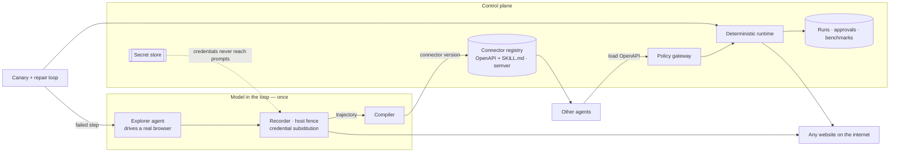
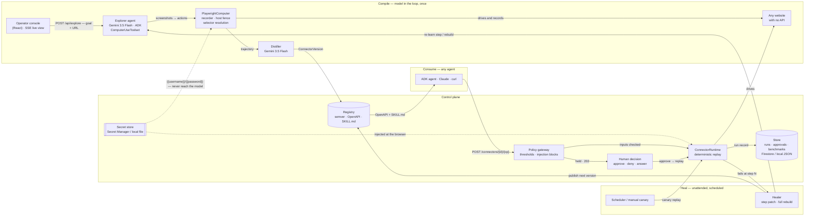

# Clickwright

**Let your agent glance at the screen a single time. Never again after that.**

Every screen-driven agent on the market — Gemini, Claude, OpenAI — spends thousands
of tokens just gazing at a page for each task: capture, parse, decide, click, loop.
Repeat the same chore a thousand times and the pixels of a login form end up costing
you what a night out would.

Clickwright lets an AI agent carry out a job in a real browser *one single time*,
turns the captured session into a connector, and replays it in about a second from
then on with no model involved. **$0 per call.** Any agent in your fleet can hit it
through a plain OpenAPI endpoint — no rendering, no tokens, no reading the page.

```
agent burns 12,000 tokens watching a screen → task complete

            ↓

Clickwright: compile that recording into a connector

            ↓

any agent calls it → 1 second, $0, no model, no screen
```

<p align="center">
  
</p>
<p align="center"><sub>Footage from a real session, untouched: an agent schedules a visit on a healthcare
portal. At the point of no return, the policy gateway freezes the submit — and a person
green-lights it from the console.</sub></p>

---

## The problem with computer-use

All the big AI firms are now shipping out computer-use agents: hand the model a
browser, let it inspect screenshots, let it click. It functions. It also drains
money and time, because **each individual task** requires:

1. Paint the page → 1 screenshot runs about 1,000–3,000 tokens
2. The model studies the screen, chooses its move → 1 inference call
3. Perform a click or keystroke → return to step 1
4. Loop 8–15 times per job

A 10-step task on Gemini Pro costs roughly **$0.03–0.06** and takes **30–60 seconds**
(measured across CURA Healthcare and the bundled target). Do it 1,000 times a month on
the same task — expense filings, appointment bookings, status checks — and you've spent
**$30–60** and waited **8–10 hours** on something a script could do in seconds.

Even if the system has an API, the agent still burns tokens figuring out how to call it:
reading docs, handling auth, interpreting responses. The overhead is real.

**That overhead is what Clickwright removes.** A single recording. A single compilation.
Every later call is a deterministic replay: no screenshots, no model, no tokens. Just
`POST` → done.

---

## Why it's different

| | Clickwright | Screen scrapers | Agent every time |
| --- | --- | --- | --- |
| How it drives the site | Steps taped from an actual session | Brittle HTML scraping | AI inspects and clicks, every run |
| Cost per call | **$0** — no model | $0 | $0.03–0.06 per task (measured) |
| Speed per call | **~1–2 s** | fast | 30–60 s |
| Token consumption | **Zero after compilation** | Zero | 8,000–30,000 per task (measured) |
| Survives redesigns | **Yes — detects, repairs, republishes** (costs one model run) | No | Yes, at full token cost |
| Callable by other agents | **Yes — OpenAPI + SKILL.md generated on demand** | No | With glue code |

A computer-use agent forfeits tokens with every page it views. Under Clickwright, that
expense is paid once.

---

## Quick start

You'll need Python 3.11+, Node 20+, `pnpm`, and a Gemini API key from
[Google AI Studio](https://aistudio.google.com). Deployment notes live in *Configuration*.

```bash
cp .env.example .env      # add your GOOGLE_API_KEY (free from Google AI Studio)
make install              # venv + Chromium + frontend deps
```

Open three terminals:

```bash
make portal     # :8081   a bundled target system
make api        # :8080   control plane + connector gateway
make console    # :5173   web console
```

Open [http://localhost:5173](http://localhost:5173):

1. The **Live** view comes pre-loaded with a sample target — hit **Start** and watch it
   work: each step appears with its reasoning and a screenshot.
2. Once it wraps up, the connector shows up under **Registry**. Try calling it the way
   a separate agent would (this is the bundled sample only — your own connectors mirror
   whichever site you aimed it at):

   ```bash
   # sample call against the bundled target
   curl -X POST http://localhost:8080/connectors/vendor-portal/expense-claim \
     -H 'content-type: application/json' \
     -d '{"claim_type":"Travel","invoice_reference":"INV-2","amount_usd":"120.00","cost_centre":"CC-4410"}'
   ```

   A moment later you're handed the confirmation reference. No model sat in that path.
3. Turn **Live** toward any real site you're allowed to use — swap in the URL and spell
   out the task in everyday language. Any website works: supplier portals, medical
   booking, news, shops, internal admin panels. Sign-in credentials slot into **Add
   sign-in details**, are kept away from the model, and get swapped in at the browser
   automatically.

### Watch it heal itself

Bring the bundled target back up with a different UI, then press **Canary** in the
Registry:

```bash
make portal-drift     # the submit button becomes a different control; copy changes
```

The health check trips on precisely the broken step, the repair loop re-learns it, and
a fresh connector version goes out — you can see it under **Drift** with a diff and the
fixer named (or the code that fixed it).

The canary costs nothing. It's a deterministic replay through the very runtime a
connector call uses — no screenshots, no model — so sweeping your entire registry with
it costs **$0 and zero tokens** every pass. A model only enters the picture when a
canary detects a break, and then it's one brief run to re-learn the step that failed.
Keeping an eye on ten connectors 24/7 is free until a site genuinely changes.

---

## A compiled connector, end to end

Exploration is only the first move. What a Clickwright run produces is a **connector**:
a versioned, deterministic API bolted onto a website that had none. Any agent treats it
like any other tool — below is what genuinely travels the wire, using the bundled
sample target.

**Find it.** `GET /api/connectors` enumerates what this fleet already offers:

```json
[
  {
    "id": "vendor-portal",
    "portal": "vendor-portal",
    "operation": "expense-claim",
    "path": "/connectors/vendor-portal/expense-claim",
    "active_version": "1.0.0"
  }
]
```

**Invoke it.** A straightforward HTTP POST carrying a JSON body:

```bash
curl -X POST http://localhost:8080/connectors/vendor-portal/expense-claim \
  -H 'content-type: application/json' \
  -d '{"claim_type":"Travel","invoice_reference":"INV-2","amount_usd":"120.00","cost_centre":"CC-4410"}'
```

```json
{
  "status": "ok",
  "reference": "EC-2026-1042",
  "confirmation": "Expense claim EC-2026-1042 recorded. Pending approval by Finance.",
  "run_id": "run_a1b2c3",
  "version": "1.0.0"
}
```

A few seconds pass, with no model anywhere in the request. A call has two more possible
verdicts:

| Answer | Meaning | What your agent does |
| --- | --- | --- |
| `200` with `reference` | It ran | Use `reference` — the id the system generated |
| `202` held | A human must decide first (large amount, protected action) | Surface it; approve or deny in the console |
| `502` with `failed_step: N` | The site changed under it | The healer repairs it automatically; `GET /api/runs/{id}` has the detail |

**The contract your agent fetches.** Each connector ships its own OpenAPI document plus
an ADK skill file, produced on demand from the active version. An agent pulls them in
like any tool — zero integration code:

```bash
curl -s localhost:8080/api/connectors/vendor-portal/openapi
curl -s localhost:8080/api/connectors/vendor-portal/skill
```

The OpenAPI document (abridged):

```json
{
  "openapi": "3.1.0",
  "info": {
    "title": "vendor-portal — expense-claim",
    "version": "1.0.0",
    "description": "Compiled from a computer-use run against vendor-portal, which exposes no API. 16 deterministic steps."
  },
  "servers": [{ "url": "http://localhost:8080" }],
  "paths": {
    "/connectors/vendor-portal/expense-claim": {
      "post": {
        "operationId": "expense_claim",
        "requestBody": {
          "required": true,
          "content": {
            "application/json": {
              "schema": {
                "type": "object",
                "properties": {
                  "claim_type":        { "type": "string", "description": "Claim type", "example": "Travel" },
                  "invoice_reference": { "type": "string", "description": "Invoice reference", "example": "INV-2" },
                  "amount_usd":        { "type": "string", "description": "Claim amount in USD", "example": "120.00" },
                  "cost_centre":       { "type": "string", "description": "Cost centre", "example": "CC-4410" }
                },
                "required": ["claim_type", "invoice_reference", "amount_usd", "cost_centre"]
              }
            }
          }
        },
        "responses": {
          "200": { "description": "Completed" },
          "202": { "description": "Held for human approval" }
        }
      }
    }
  }
}
```

The skill file, ready to drop into ADK's `SkillRegistry`:

```markdown
---
name: vendor-portal-expense-claim
description: expense-claim on vendor-portal, a system with no API. Use when a task requires expense claim.
---

# vendor-portal — expense-claim

Call `POST /connectors/vendor-portal/expense-claim` with:

- `claim_type` (string) — Claim type: Travel, Equipment or Subsistence
- `invoice_reference` (string) — Invoice reference from the purchase
- `amount_usd` (string) — Claim amount in US dollars
- `cost_centre` (string) — Internal cost centre code

Compiled from run `run_a1b2c3`, version 1.0.0.
```

Both derive from the *active* version, so when the healer ships a repair, the document
and skill refresh along with it — agents that re-pull stay functional, and nothing on
the calling side ever has to change. Copy-paste recipes for ADK, the Claude API, and raw
HTTP sit in [docs/using-a-connector.md](docs/using-a-connector.md).

---

## Benchmarks

An AI agent clicking around a site is sluggish and expensive with every single run.
Clickwright observes it one time, records the steps as a reusable *connector*, and
afterwards completes the job instantly and free with no AI in the loop. But sites move
their buttons around — so the meaningful question is less "does it work today?" and
more "**does it spot when the site breaks it, and does it patch itself?**"

The benchmark (`bench/run_suite.py`) settles it with three checks. None of them call
for an AI model to execute:

| Check | What it asks | Why it matters |
| --- | --- | --- |
| **Does it still work?** | Replays the saved steps against the live website | This is the product: seconds per call, $0 |
| **Does it find the break?** | Quietly break one step's pointer to a button; the health check must call out *that exact step* | A fixer that repairs the wrong step is worse than having none |
| **Does it recover?** | Restore the good steps — the next call must succeed | Shows the breakage was temporary, not lasting damage |

Run it yourself across every connector in your registry:

```bash
PYTHONPATH=. python -m bench.run_suite
```

It prints a table and writes a complete report to `var/bench/<timestamp>/report.md`.
Optional toggles: `--heal` (use a genuine model for repairs rather than a mock),
`--only id1,id2` (restrict targets), `--explore` / `--judge` / `--llm` (extra passes
described lower down).

### How does its self-repair compare with other approaches?

People who research self-healing web tests evaluate repair the same way we do:
deliberately break something, then observe which repair methods restore the automation
and how quickly (this matches the protocol in studies such as Similo and VON-Similo-LLM).
We pushed the same broken target through every approach:

| Approach | Fixed the break? | Speed | AI cost |
| --- | --- | --- | --- |
| Do nothing | 0 of 2 — remains broken until a human rewrites it | — | $0 |
| Match by labels — the classic self-healing-tool approach | 1 of 2 — only works when the original recording happened to keep readable notes | ~9s | $0 |
| Ask an AI model "which element on this page is the new one?" (`--llm`) | available as an extra flag | ~seconds | 1 call per repair |
| **Clickwright** — re-do the broken step like a user would, check the result, publish the fix | **2 of 2** | ~16s | 1 short agent run |

The instructive miss is row two: label-matching could only fix steps the recording had
preserved as readable notes. That is precisely why research shifted to context-aware
techniques — and why Clickwright's healing doesn't rely on whatever the recording
happened to save.

Two optional passes exercise the AI end of the product, and they say so: `--explore`
reports how much of the agent's proposed plan survives our validation once compiled into
a connector, while `--judge` scores raw explorations the way the WebVoyager benchmark
does. Those figures describe the *model* you connected, not Clickwright.

---

## How it works

| | Stage | What happens |
|---|---|---|
| 1 | **Explore** | An AI agent receives a URL and an everyday-language goal. It launches a real browser, studies the page, decides, clicks, types, checks the outcome. A single time. |
| 2 | **Compile** | A second pass splits the values callers will vary (amounts, references) from the surrounding structure, drafts an input schema, and pins assertions to on-screen text — so a later replay can distinguish a success from a silently wrong page. Steps persist as stable locators captured from the live page, never dreamed up by the model. |
| 3 | **Publish** | The output is a versioned connector: an OpenAPI document and a skill file, generated on demand from the stored playbook and scoped to the host it was compiled against. |
| 4 | **Consume** | Any agent — even one that has never touched a browser — loads that document and calls the site as if it were a normal API. Deterministic replay: no model, seconds, $0. |
| 5 | **Heal** | Scheduled canaries replay every connector. When a step no longer matches, the run fails at that very step, the repair loop re-learns it, checks the outcome, and publishes the following version. No human required. |



### Safety

| Rail | What it does |
| --- | --- |
| **Host fence** | A connector may only drive the host it was compiled against. Navigation to other sites is rejected both during exploration *and* during replay. A fleet-wide ceiling (`TARGET_ALLOWED_HOSTS`) bounds the set. |
| **Credentials stay out of the AI** | Sign-in details are kept in a secret store. The model is instructed to type literal placeholders; the browser exchanges them for the real values. Secrets never surface in prompts, screenshots, or recorded steps. |
| **Policy gateway** | Every connector call crosses a single boundary: amounts over a threshold are suspended before the browser even opens; instruction-shaped payloads ("ignore all previous instructions…") are refused; held actions sit until a person decides in the console. An approval replays the original payload, and the audit trail preserves both. |
| **PII redaction** | Emails, card numbers, phone numbers, and IBANs get scrubbed before anything is stored or rendered. |
| **Human pause** | Mid-run, the agent may halt and query the operator — a one-time code, a decision — right from the console. Sensitive responses arrive as tokens the model is never shown. |
| **Observability** | A trace span for every model turn, browser step, and connector call (Cloud Trace once deployed). |

---

## Architecture

The model participates exactly once, during exploration. From that point on — each
connector call, each canary, each heal — everything is deterministic. The diagram
shows the entire system, and the edge labels name the actual endpoints.



What each box is, and where it lives:

| Box | Component | Role |
| --- | --- | --- |
| Explorer agent | `app/agents/explorer.py` | The one spot a model touches the browser. An ADK agent running Google's Gemini 3.5 Flash, shielded by prompt-injection detection and a human pause before irreversible actions. |
| PlaywrightComputer | `app/computer/playwright_computer.py` | ADK's `BaseComputer` inside a real Chromium. Turns every click into a durable selector (`data-testid → id → name → label → text`), exchanges `{{credentials}}` at the browser so the model never sees them, and tapes the trajectory. |
| Host fence | `app/computer/hosts.py` | Blocks navigation beyond the connector's scope and any fleet-wide `TARGET_ALLOWED_HOSTS` ceiling. |
| Distiller | `app/agents/distiller.py` | Condenses the one-shot trajectory into a versioned playbook: the values destined to become inputs, the assertions that survive, selectors lifted directly from the recording — never fabricated. |
| Registry | `app/connectors/registry.py` | Semver versioning, publish/supersede flows, and OpenAPI + SKILL.md documents produced on demand for any agent. |
| Policy gateway | `app/governance/policy.py` | A single boundary before every connector call: financial-threshold holds, instruction-shaped payload blocks, and the mid-run consequential-action pause. |
| ConnectorRuntime | `app/connectors/runtime.py` | Replays the playbook deterministically. No model, no tokens, seconds. Fails with the exact step index so the healer knows precisely where to begin. |
| Healer | `app/agents/healer.py` | Runs scheduled canaries; upon failure patches the single broken step or rebuilds the playbook, verifies, and publishes the next version. No human asked. |
| Store / Secret store | `app/store.py`, `app/governance/secrets.py` | Runs, approvals, benchmarks, and credentials. Firestore + Secret Manager in the cloud, with matching JSON-on-disk stores so the whole thing runs on a laptop with no cloud account. |

**Google Cloud surface:** the entire service runs on **Cloud Run**, persistence lives
in **Firestore** (registry, runs, approvals, benchmarks), secrets rest in **Secret
Manager**, and every model turn, connector call and browser step produces a **Cloud
Trace** span. The scheduler triggers the nightly canary. Nothing further is asserted:
no Pub/Sub, no Cloud SQL, no GKE — the fewer moving parts, the closer this gets to
something a judge can actually run.

---

## What to point it at

**Works well**

- Any site you currently click through manually: supplier portals, benefits
  administration, HR and payroll consoles, practice-management systems, filing portals.
- Server-rendered forms and wizards — steady structure, genuine element ids, one page
  per step. Those compile into brief, long-lived playbooks.
- Public sites as well: news outlets, docs portals, storefronts. Shifting content is
  precisely what the canary-and-repair loop exists for.
- Anything you could outline to a new colleague in three sentences.

**Works, with care**

- Single-page apps: workable, though generated class names leave pointers brittle — plan
  for the repair loop to justify itself. Sites carrying `data-testid` attributes compile
  the cleanest.
- Multi-factor sign-in: during exploration the agent halts and requests the code from
  you. Unattended replay never receives codes, so compile the portion after login.
- Sites with aggressive bot defences: CAPTCHAs were built to stop precisely this, and
  Clickwright makes no attempt to beat them, on purpose.

**Do not point it at**

- Anywhere you lack authorization. The tool is indifferent to permission; you are not.
- Sites whose terms forbid automated access. Being able to operate a page is not the
  same as having leave to.
- Irreversible actions you haven't scoped — payments, deletions, third-party
  submissions. Those get held for human approval deliberately. Don't work around it.

---

## Configuration

All settings flow from the environment (see `.env.example`). The core ones:

| Variable | Default | Meaning |
| --- | --- | --- |
| `GOOGLE_API_KEY` | — | Gemini API key for exploration and compilation (from Google AI Studio) |
| `GOOGLE_GEMINI_BASE_URL` | — | Override the Gemini endpoint (proxy, regional host, etc.) |
| `CLICKWRIGHT_EXPLORER_MODEL` / `_DISTILLER_MODEL` | `gemini-3.5-flash` | Which Gemini models do the exploring / compiling |
| `CLICKWRIGHT_HEAL_STRATEGY` | `auto` | `step` patches the broken step only; `full` rebuilds the playbook; `auto` patches once, then escalates to a rebuild if an already-healed version breaks again |
| `TARGET_ALLOWED_HOSTS` | — | Deployment-wide host ceiling (comma-separated, leading dot covers subdomains) |
| `HEADFUL` | `0` | `1` = watch the browser work instead of running headless |
| `DRIFT` | `0` | `1` = the bundled target serves its redesigned UI (for the self-heal demo) |

---

## Calling a connector from another agent

Copy-paste examples for ADK, the Claude API, and raw HTTP live in
[docs/using-a-connector.md](docs/using-a-connector.md) — including what occurs when a
call needs a person in the middle. The pattern:

1. Discover: `GET /api/connectors` — "what can this fleet already do?"
2. Learn the signature: `GET /api/connectors/{id}/openapi` — loads straight into an
   agent framework's tool loader; the `servers` block is the base URL.
3. Call: `POST /connectors/{id}/{operation}` with JSON inputs.
4. Possibly get `202 held` — an amount over threshold or suspicious input — and approve
   it in the console or via `POST /api/approvals/{id}/approve`.

The complete API reference (runs, diffs, approvals, benchmarks, SSE events, artifacts)
is served at `/docs` by the running API.

---

## Deploy to Google Cloud

```bash
gcloud services enable run.googleapis.com aiplatform.googleapis.com firestore.googleapis.com \
  pubsub.googleapis.com cloudscheduler.googleapis.com secretmanager.googleapis.com \
  storage.googleapis.com cloudtrace.googleapis.com artifactregistry.googleapis.com

gcloud firestore databases create --location=nam5
make deploy PROJECT=<your-project> REGION=us-central1
```

Cloud Run requires **2 vCPU / 4 GiB** — Chromium runs out of memory below 1 GiB. The
Makefile target takes care of that, adding a startup CPU boost and a 3600 s timeout for
lengthy explorations. Set up the nightly health check:

```bash
gcloud scheduler jobs create http clickwright-canary \
  --schedule "0 2 * * *" --uri "$SERVICE_URL/api/heal/<connector-id>" --http-method POST
```

---

## Tests

```bash
make test
```

```
100 passed
```

These include an end-to-end run of a compiled playbook steering a real Chromium at a
real target; a drift test confirming the failure lands on the exact step whose selector
was removed; scope tests exercising off-host navigation and deployment ceilings; and the
benchmark's own legs — detection precision, recovery, and the repair-strategy comparison
— exercised offline against the bundled target.

---

## Repository

```
app/
  agents/        explorer · compiler · healer · consumer
  computer/      browser driver · selector recorder · host fence
  connectors/    models · registry · deterministic runtime
  governance/    secrets · policy gateway · redaction
  server.py      control-plane API + connector gateway + SSE
  telemetry.py   tracing
bench/           architecture benchmark suite + explore-vs-replay economics
portal/          a bundled target system (2 tenants, DRIFT flag)
frontend/        React + Vite console
tests/           end-to-end, scope, benchmark, and unit tests
docs/            calling a connector from another agent
var/             registry, runs, artifacts, benchmark reports (created at runtime)
```

`portal/` is a genuine FastAPI app with sessions, validation, and a wizard resilient to
out-of-order use. It ships so anyone can reproduce a complete run — healing included,
which needs a target whose UI can be altered on demand (`DRIFT=1`). Nothing is faked:
the console reads the live API, the registry holds real compiled artifacts, and every
figure displayed was measured.

### Limitations

- Connectors are single-operation on purpose: one compiled flow, one endpoint. Chain
  several connectors from the calling agent.
- Replay assumes the page's controls still exist. Content-only shifts (a rotating
  headline) are irrelevant; structural changes kick off a repair cycle.
- Every repair cycle costs one brief agent run. On fast-changing sites, budget for more
  cycles than a stable internal form would require.
- Unattended replay can't handle MFA challenges — compile flows that begin after login.
- Bot defences that stop automation also stop Clickwright. That sits out of scope by
  design.